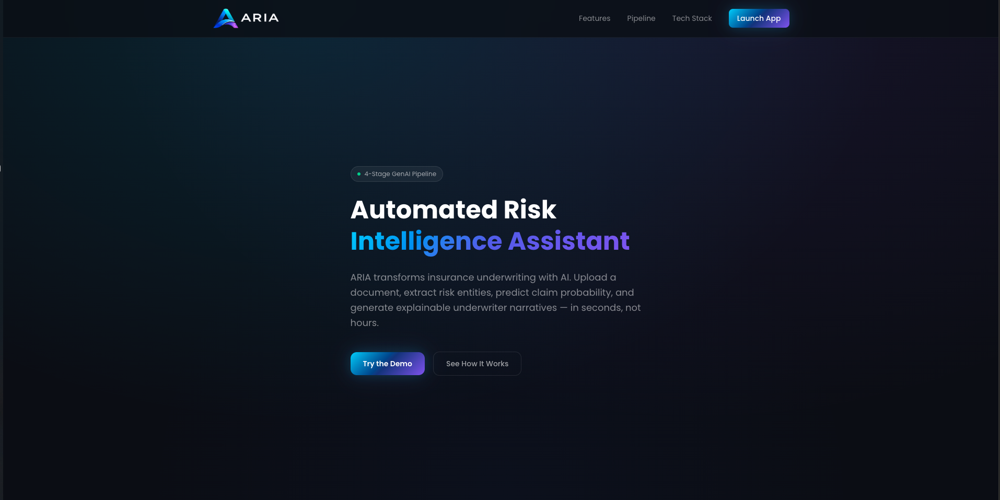
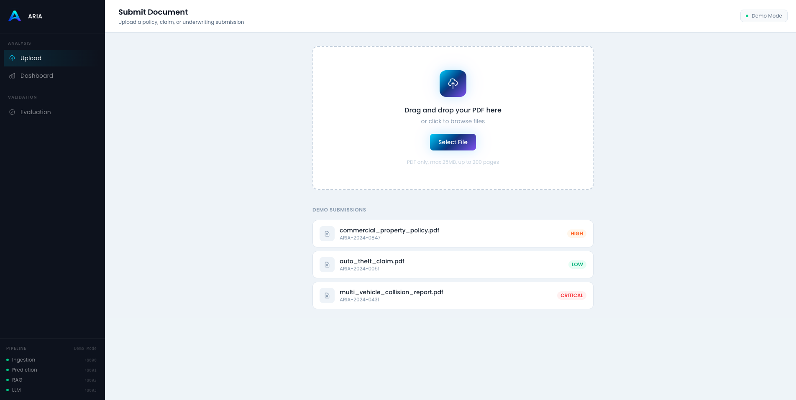
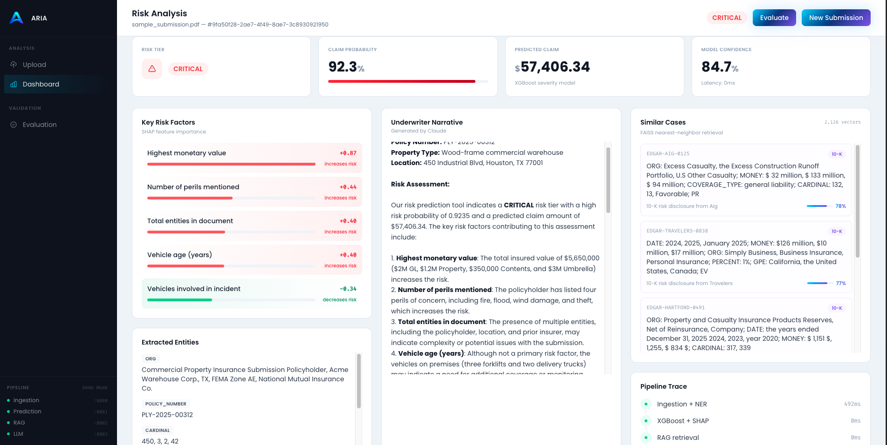
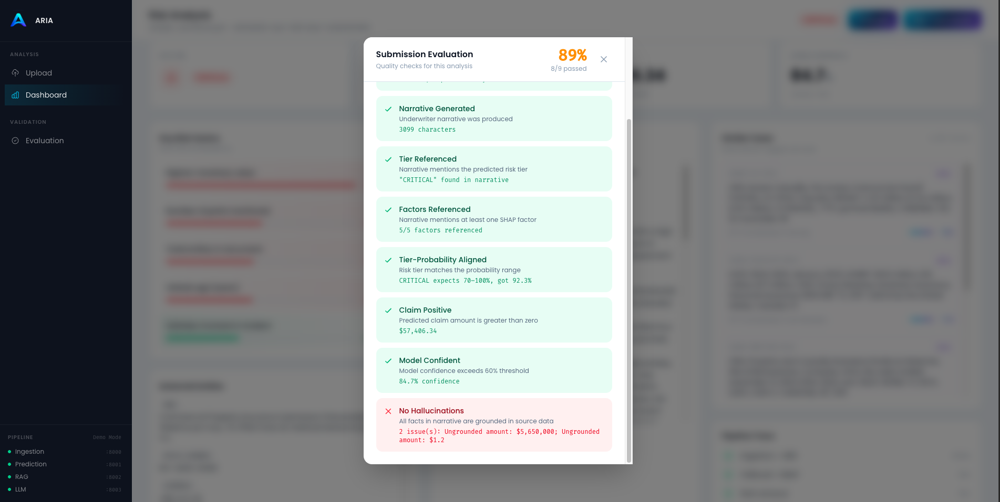
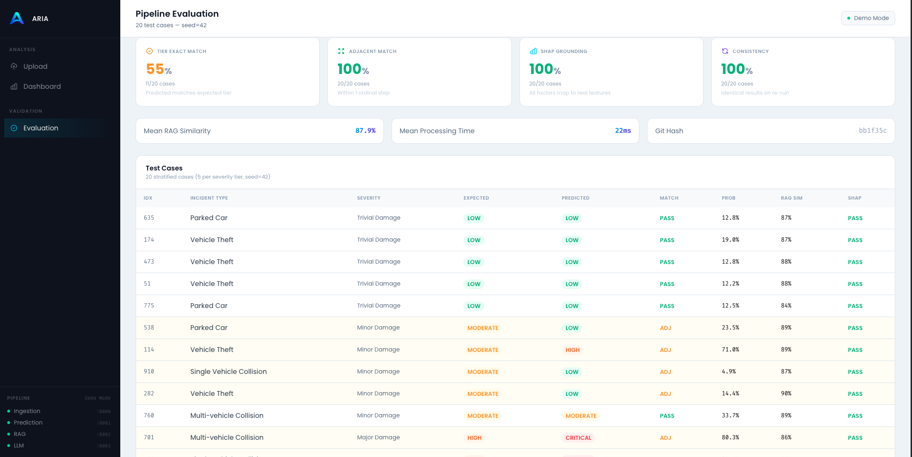

# ARIA -- Automated Risk Intelligence Assistant

ARIA is a 4-stage GenAI pipeline for insurance underwriting. Upload a PDF document, extract risk entities with NER, predict claim probability with XGBoost, retrieve similar cases via FAISS vector search, and generate an explainable underwriter narrative with an LLM.

**Live demo (demo mode):** [aria-pi-blond.vercel.app](https://aria-pi-blond.vercel.app)

---

## Screenshots

### Landing Page


### Upload Dashboard


### Risk Analysis (Live Pipeline)


### Submission Evaluation Modal


### Pipeline Evaluation (20 Cases)


---

## Table of Contents

- [Architecture](#architecture)
- [Pipeline Stages](#pipeline-stages)
- [Tech Stack](#tech-stack)
- [Project Structure](#project-structure)
- [Getting Started](#getting-started)
- [Running the Backend](#running-the-backend)
- [Running the Frontend](#running-the-frontend)
- [Training the Model](#training-the-model)
- [Evaluation Framework](#evaluation-framework)
- [API Reference](#api-reference)
- [Data Sources](#data-sources)
- [Configuration](#configuration)
- [Testing](#testing)
- [License](#license)

---

## Architecture

```
                         +------------------+
                         |   React Frontend |
                         |  (Vite + Tailwind)|
                         +--------+---------+
                                  |
                    Upload PDF    |   View Results
                                  |
                    +-------------v--------------+
                    |    Ingestion Service :8000  |
                    |    PySpark + spaCy NER      |
                    +-------------+--------------+
                                  |
                          entity_summary
                                  |
                    +-------------v--------------+
                    |    LLM Orchestrator :8003   |
                    |    Claude / Ollama          |
                    +---+--------------------+---+
                        |                    |
              tool call |                    | tool call
                        |                    |
          +-------------v------+   +---------v-----------+
          | Prediction  :8001  |   |   RAG Search :8002  |
          | XGBoost + SHAP     |   |   FAISS + MiniLM    |
          +--------------------+   +---------------------+
```

Four FastAPI microservices orchestrated by Docker Compose:

| Service    | Port | Purpose                                  | Stack                          |
|------------|------|------------------------------------------|--------------------------------|
| ingestion  | 8000 | PDF text extraction and entity recognition | PySpark, spaCy (custom NER)    |
| prediction | 8001 | Risk tier classification and explainability | XGBoost, SHAP (28 features)    |
| rag        | 8002 | Similar case retrieval                   | FAISS IndexFlatIP, all-MiniLM-L6-v2 |
| llm        | 8003 | Orchestration and narrative generation   | Claude (tool-use) / Ollama     |

---

## Pipeline Stages

### Stage 1: Ingestion (NER)

- Accepts PDF uploads via multipart form data
- Extracts text using PyMuPDF (fitz)
- Runs a custom-trained spaCy NER model to identify entities:
  - `PERIL` (fire, flood, wind, earthquake, theft)
  - `MONEY` (dollar amounts)
  - `COVERAGE_TYPE` (general liability, umbrella, property)
  - `PROPERTY_TYPE` (warehouse, commercial, residential)
  - `VEHICLE`, `INJURY`, `POLICY_NUMBER`, `DATE`, `ORG`, `GPE`, `CARDINAL`
- Outputs an `entity_summary` dict used by all downstream stages

### Stage 2: Prediction (XGBoost + SHAP)

- Consumes the `entity_summary` and extracts 28 numerical features
- Runs an XGBoost classifier trained on severity-based risk tiers (LOW / MODERATE / HIGH / CRITICAL)
- Produces:
  - `risk_tier` -- ordinal classification
  - `risk_probability` -- calibrated probability
  - `predicted_claim_amount` -- dollar estimate
  - `key_risk_factors` -- top 5 SHAP values with direction (increases/decreases risk)
- Training and inference use the same `extract_features()` function to prevent skew

### Stage 3: RAG (FAISS Vector Search)

- Encodes the entity summary into a 384-dim vector using `all-MiniLM-L6-v2`
- Searches a FAISS IndexFlatIP index containing 2,126 vectors:
  - Kaggle insurance claims (IDs 0-9999)
  - SEC EDGAR 10-K filings from 8 major insurers (IDs 10000+)
- Returns top-k similar cases with similarity scores
- Sub-50ms latency at current index size

### Stage 4: LLM Narrative (Claude / Ollama)

- The LLM service acts as an orchestrator using the tool-use pattern
- Calls prediction and RAG as tools, then synthesizes results into a narrative
- Produces a structured underwriter report with:
  - Risk assessment summary
  - Key concerns with supporting data
  - Mitigating factors
  - Historical comparison from similar cases
  - Recommendation (approve / conditional / deny)
- Provider protocol pattern: `AnthropicProvider` for production (Claude), `OllamaProvider` for local development

---

## Tech Stack

### Backend
- **Python 3.12** with FastAPI
- **PySpark** for distributed text processing
- **spaCy** with custom-trained NER pipeline
- **XGBoost** for gradient-boosted risk classification
- **SHAP** for model explainability
- **FAISS** for approximate nearest-neighbor search
- **sentence-transformers** (all-MiniLM-L6-v2) for text embeddings
- **Anthropic SDK** (Claude) and **Ollama** for LLM inference
- **Docker Compose** for service orchestration

### Frontend
- **React 19** with Vite 8
- **Tailwind CSS 4** for styling
- **React Router 7** for client-side routing
- Deployed on **Vercel**

### Tooling
- **Ruff** for Python linting and formatting
- **pytest** (55 tests) for backend testing
- **ESLint** for frontend linting
- **pre-commit hooks** for code quality

---

## Project Structure

```
ARIA/
|-- services/
|   |-- ingestion/        # PDF upload, text extraction, spaCy NER
|   |-- prediction/       # XGBoost risk tier + SHAP explanations
|   |-- rag/              # FAISS similarity search
|   |-- llm/              # LLM orchestrator (Claude / Ollama tool-use)
|   |-- shared/           # Common utilities
|
|-- frontend/
|   |-- app/              # React + Vite + Tailwind application
|   |   |-- src/
|   |   |   |-- components/   # UI components (dashboard, layout, shared, landing)
|   |   |   |-- pages/        # LandingPage, DashboardPage, EvalPage
|   |   |   |-- hooks/        # useDemoData
|   |   |   |-- lib/          # api.js (backend API client)
|   |   |   |-- data/         # Demo JSON fixtures
|   |   |-- public/           # Logo assets, favicon
|   |-- mockup/           # HTML/Tailwind design mockups
|   |-- assets/           # Brand assets
|
|-- scripts/
|   |-- train_xgboost.py      # Train model on Kaggle data
|   |-- build_case_index.py   # Build FAISS index from Kaggle claims
|   |-- download_edgar.py     # Download SEC EDGAR 10-K filings
|   |-- index_edgar.py        # Chunk + index EDGAR filings into FAISS
|   |-- eval_pipeline.py      # 20-case stratified evaluation
|
|-- data/
|   |-- raw/              # insurance_claims.csv (Kaggle)
|   |-- edgar/            # SEC EDGAR 10-K text files
|   |-- faiss/            # FAISS index files (gitignored)
|   |-- eval/             # eval_report.json
|
|-- models/               # Trained XGBoost model artifacts
|-- notebooks/            # Exploration notebooks
|-- docker-compose.yml    # Multi-service orchestration
|-- pyproject.toml        # Python project config (Ruff, mypy, pytest)
```

---

## Getting Started

### Prerequisites

- Python 3.12+
- Node.js 18+
- Docker and Docker Compose
- Ollama (for local LLM inference) or an Anthropic API key (for Claude)

### Clone and setup

```bash
git clone https://github.com/<your-username>/ARIA.git
cd ARIA

# Create and activate virtual environment
python -m venv .venv
source .venv/bin/activate

# Install Python dependencies
pip install -r requirements.txt

# Install frontend dependencies
cd frontend/app
npm install
cd ../..
```

### Environment variables

Create a `.env` file in the project root:

```env
# LLM provider: "ollama" for local, "anthropic" for production
LLM_PROVIDER=ollama
OLLAMA_MODEL=llama3.2
OLLAMA_BASE_URL=http://localhost:11434

# Only needed if LLM_PROVIDER=anthropic
ANTHROPIC_API_KEY=your-key-here
```

---

## Running the Backend

### With Docker (recommended)

```bash
# Start all 4 services
docker compose up --build

# Verify health
curl http://localhost:8000/health   # ingestion
curl http://localhost:8001/health   # prediction
curl http://localhost:8002/health   # rag
curl http://localhost:8003/health   # llm
```

All services include health checks and will show as "healthy" in `docker compose ps`.

### With Ollama (local LLM)

```bash
# Install and start Ollama
ollama serve

# Pull the model
ollama pull llama3.2
```

The Docker LLM service connects to Ollama via `host.docker.internal:11434`.

---

## Running the Frontend

### Development

```bash
cd frontend/app
npm run dev
# Opens at http://localhost:5173
```

### Demo mode vs Live mode

- **Demo mode** -- Works without a backend. Three pre-loaded submissions (HIGH / LOW / CRITICAL risk) with static JSON data. Available on the Vercel deployment.
- **Live mode** -- Upload any PDF. Requires Docker services running on localhost. The frontend calls `POST /extract` (ingestion) and `POST /synthesize` (LLM orchestrator) to run the full pipeline.

### Deployment

The frontend is deployed on Vercel with the root directory set to `frontend/app`.

---

## Training the Model

### XGBoost risk classifier

```bash
# Train on Kaggle insurance claims data
python scripts/train_xgboost.py
```

- Uses `data/raw/insurance_claims.csv` as training data
- Target variable: `incident_severity` mapped to risk tiers (LOW / MODERATE / HIGH / CRITICAL)
- Extracts 28 features from entity summaries using `extract_features()`
- Outputs model artifacts to `models/`

### FAISS index

```bash
# Build index from Kaggle claims
python scripts/build_case_index.py

# Download and index SEC EDGAR filings
python scripts/download_edgar.py
python scripts/index_edgar.py
```

- Kaggle cases indexed with IDs 0-9999
- EDGAR cases offset by 10000 to avoid ID collisions
- Final index: 2,126 vectors, 384 dimensions (all-MiniLM-L6-v2)

---

## Evaluation Framework

The evaluation pipeline validates model outputs across 20 stratified cases (5 per severity tier, seed=42).

### Run evaluation

```bash
# Direct mode (no Docker needed)
python scripts/eval_pipeline.py

# Against running Docker services
python scripts/eval_pipeline.py --live

# Include LLM narrative + hallucination detection
python scripts/eval_pipeline.py --include-llm
```

### Checks per case

| Check             | What it validates                                              |
|-------------------|---------------------------------------------------------------|
| tier_match        | Predicted risk tier matches expected tier                      |
| tier_adjacent     | Predicted tier within 1 ordinal step of expected               |
| claim_reasonable  | Predicted claim > 0, ratio to actual between 0.05x-20x        |
| shap_grounded     | All SHAP factor names exist in valid feature list              |
| rag_has_results   | At least 1 FAISS result with similarity > 0                    |
| rag_type_match    | Retrieved case contains same incident type keyword             |
| consistency       | Re-running same case produces identical results                |

### Current results (seed=42, 20 cases)

| Metric                | Value   |
|-----------------------|---------|
| Tier exact match      | 55% (11/20) |
| Tier adjacent match   | 100% (20/20) |
| SHAP grounding        | 100% (20/20) |
| Consistency           | 100% (20/20) |
| Mean RAG similarity   | 0.88    |
| Mean processing time  | 22ms    |

### Frontend submission evaluation

The dashboard includes an "Evaluate" button that runs 9 client-side quality checks on any submission (demo or live):

1. **SHAP Grounded** -- All risk factor names are valid model features
2. **RAG Retrieved** -- Similar cases found with meaningful similarity (> 50%)
3. **Narrative Generated** -- Underwriter narrative exceeds 50 characters
4. **Tier Referenced** -- Narrative mentions the predicted risk tier
5. **Factors Referenced** -- Narrative mentions at least one SHAP factor
6. **Tier-Probability Aligned** -- Risk tier falls within expected probability range
7. **Claim Positive** -- Predicted claim amount is greater than zero
8. **Model Confident** -- Model confidence exceeds 60% threshold
9. **No Hallucinations** -- Dollar amounts and percentages in narrative are traceable to source data

---

## API Reference

### Ingestion Service (port 8000)

**POST /extract**

Upload a PDF for entity extraction.

- Content-Type: `multipart/form-data`
- Body: `file` (PDF)
- Response:
```json
{
  "submission_id": "uuid",
  "filename": "document.pdf",
  "full_text": "extracted text...",
  "entity_summary": {
    "PERIL": ["fire", "flood"],
    "MONEY": ["$1,200,000"],
    "ORG": ["Acme Corp"]
  },
  "processing_time_ms": 142
}
```

### LLM Orchestrator (port 8003)

**POST /synthesize**

Run prediction + RAG + narrative generation.

- Content-Type: `application/json`
- Body:
```json
{
  "submission_id": "uuid",
  "entity_summary": { ... },
  "full_text": "extracted text..."
}
```
- Response:
```json
{
  "submission_id": "uuid",
  "risk_tier": "HIGH",
  "risk_probability": 0.7274,
  "predicted_claim_amount": 82991,
  "key_risk_factors": [
    { "name": "Highest monetary value", "shap_value": 0.921, "direction": "increases_risk" }
  ],
  "underwriter_narrative": "## Risk Assessment Summary\n...",
  "similar_cases": [
    { "policy_id": "PLY-2023-00847", "similarity_score": 0.92, "summary": "..." }
  ],
  "confidence_score": 0.657,
  "processing_time_ms": 2603
}
```

### Internal Services

- **POST /predict** (prediction:8001) -- Called by LLM orchestrator via tool-use
- **POST /search** (rag:8002) -- Called by LLM orchestrator via tool-use
- **GET /health** (all services) -- Health check endpoint

---

## Data Sources

- **Kaggle**: [Auto Insurance Claims Dataset](https://www.kaggle.com/datasets) at `data/raw/insurance_claims.csv`
- **SEC EDGAR**: 10-K annual filings from 8 major insurers:
  - AIG, Travelers, Allstate, Progressive, Chubb, MetLife, Hartford, Markel

---

## Configuration

### Python (pyproject.toml)

- Ruff linting with pycodestyle, pyflakes, isort, pyupgrade, bugbear
- Line length: 99
- mypy strict mode with Pydantic plugin
- pytest configured for `services/` and `tests/` directories

### Frontend

- Vite 8 with React plugin
- Tailwind CSS 4 with custom brand tokens
- Path aliases via `@/` prefix

### Design tokens

| Token          | Value     |
|----------------|-----------|
| Brand cyan     | `#00d4ff` |
| Brand blue     | `#1e3a8a` |
| Brand purple   | `#8b5cf6` |
| Risk LOW       | `#10b981` |
| Risk MODERATE  | `#f59e0b` |
| Risk HIGH      | `#f97316` |
| Risk CRITICAL  | `#ef4444` |
| Font primary   | Poppins   |
| Font mono      | Fira Code |

---

## Testing

```bash
# Activate venv
source .venv/bin/activate

# Run all 55 tests
python -m pytest services/ -x -q

# Run with verbose output
python -m pytest services/ -v

# Lint Python
ruff check .

# Lint frontend
cd frontend/app && npm run lint
```

Tests use `TestClient` (not `httpx.AsyncClient`) to ensure FastAPI lifespan events fire correctly.

---

## Key Design Decisions

- **Severity-based ML target**: `incident_severity` mapped to ordinal risk tiers, not raw dollar amounts
- **No target leakage**: `CLAIM_STATUS` excluded from entity summaries to prevent data leakage
- **Provider protocol pattern**: Common interface for `AnthropicProvider` and `OllamaProvider`, switchable via env var
- **Tool-use orchestration**: LLM service calls prediction and RAG as tools rather than chaining HTTP calls
- **FAISS IndexFlatIP**: Inner-product similarity on normalized vectors, exact search at current scale
- **EDGAR ID offset**: Case IDs from EDGAR filings start at 10000 to avoid collisions with Kaggle case IDs
- **PySpark environment**: `PYSPARK_PYTHON` set to `sys.executable` before SparkSession creation

---

## License

This project is for educational and demonstration purposes.
